# HW3 — DQN 及其變體

**課程：** 國立中興大學 強化學習  
**環境：** 4×4 GridWorld（Goal、Pit、Wall、Player）  
**框架：** PyTorch · PyTorch Lightning · 環境隔離使用 [uv](https://docs.astral.sh/uv/)

---

## 環境安裝

```bash
# 第一次使用，安裝 uv
winget install astral-sh.uv

# 建立虛擬環境並安裝所有相依套件（此時 torch 是 CPU 版）
uv sync

# GPU 環境（GTX 1650 Ti / CUDA 12.6）：執行一次即可
# 這會把 torch 換成 CUDA 版；之後用 --frozen 執行以避免被 sync 蓋回 CPU 版
setup_gpu.bat

# 執行任意腳本（--frozen 跳過 sync，保留 CUDA torch）
uv run --frozen python hw3_1_naive_dqn.py
```

> **注意**：`uv run`（沒有 `--frozen`）每次執行前會先 sync，會把 CUDA torch 換回 PyPI 的 CPU 版。
> 一律使用 `uv run --frozen python ...`。

---

## GridWorld 環境說明

這是一個 4×4 的格子世界，Agent 每步會受到環境回饋，目標是找到最短路徑走到 Goal 且避開 Pit。

| 符號 | 意義 | 獎勵 |
|------|------|------|
| `P` | 玩家（Agent） | — |
| `G` | 目標（Goal） | **+10**，結束回合 |
| `X` | 陷阱（Pit） | **−10**，結束回合 |
| `#` | 牆壁（Wall） | **−1**，原地不動 |
| `.` | 空格 | **−1** |

Agent 每步均有 −1 的步數懲罰，促使其學習走最短路徑而非隨意遊走。

| 模式 | Player 位置 | Goal / Pit / Wall | 難度 | 使用於 |
|------|------------|-------------------|------|--------|
| `static` | 固定 (0,3) | 全部固定 | 最低 | HW3-1 |
| `player` | 隨機 | 固定 | 中等 | HW3-2 |
| `random` | 隨機 | 全部隨機 | 最高 | HW3-3、HW3-4 |

---

## HW3-1 — Naive DQN · Static Mode

### 做了什麼

實作最基礎的 Deep Q-Network，搭配 **Experience Replay Buffer**。

- **網路架構：** 3 層 MLP（輸入 64 維 one-hot 狀態，輸出 4 個動作的 Q 值）
- **Experience Replay：** 容量 10,000，每次從 buffer 隨機抽 64 筆訓練，打破時序相關性
- **Target Network：** 每 20 回合做一次 hard update，穩定訓練目標
- **探索策略：** ε-greedy，ε 從 1.0 衰減至 0.05（每回合乘以 0.995）

### 怎麼觀察

- **Training Progress GIF**：可以看到 ep 1 時 Agent 幾乎亂走，隨訓練推進逐漸找到通往 Goal 的路線
- **Reward 曲線**：早期 reward 大多為負（踩 Pit 或超時），後期應穩定靠近 +10
- **Loss 曲線**：初期震盪大，代表 Q 值更新劇烈；後期趨於平緩表示 Q 值收斂

### 訓練過程（ep 1 → 1000，每 50 ep 紀錄一次）

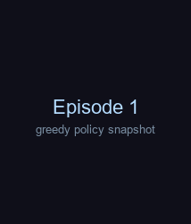

### Reward & Loss 曲線

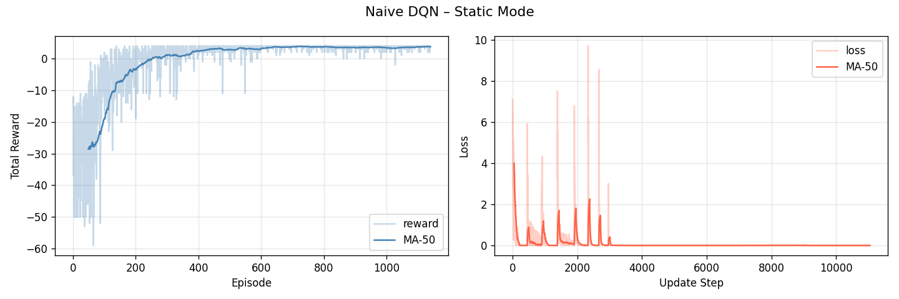

### 各階段快照

| Ep 1（隨機亂走） | Ep 250（開始學習） | Ep 500（策略成形） | Ep 1000（策略穩定） |
|---|---|---|---|
| 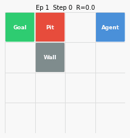 |  |  |  |

---

## HW3-2 — Enhanced DQN 變體比較 · Player Mode

### 做了什麼

在 Player 隨機出生的情境下，比較四種 DQN 變體，測試策略的**泛化能力**。

#### Double DQN

Naive DQN 的 target 計算方式：

```
Q_target = r + γ · max_a Q_target(s', a)
```

這讓同一個 target network 同時「選動作」又「估值」，容易高估 Q 值。  
Double DQN 改為：

```
a* = argmax_a Q_online(s', a)      # 由 online net 選動作
Q_target = r + γ · Q_target(s', a*)  # 由 target net 評估
```

這樣可以有效**降低 Q 值高估偏差**，訓練更穩定。

#### Dueling DQN

將 Q(s,a) 分解為兩條獨立的流：

```
Q(s, a) = V(s) + [ A(s, a) − mean_a A(s, a) ]
```

- **V(s)**：狀態本身的價值（不管做什麼動作）
- **A(s, a)**：選動作 a 相對於平均的優勢

對於那些「不管做什麼動作結果都差不多」的狀態（例如空曠走廊），V(s) 可以更快收斂，不必逐一更新每個動作的 Q 值。

| 變體 | 相對 Naive DQN 的改變 |
|------|-----------------------|
| **Naive DQN** | 基準線 |
| **Double DQN** | 分離動作選擇與價值估計，降低高估偏差 |
| **Dueling DQN** | 分解 V(s) + A(s,a)，改善狀態估計效率 |
| **Dueling + Double DQN** | 同時應用兩項改進 |

### 怎麼觀察

- **Comparison 圖**：觀察 MA-50 reward 曲線，Double 與 Dueling 應比 Naive 更早收斂、方差更小
- **各 progress GIF**：比較不同變體在相同回合時，策略是否更穩定、路徑是否更短
- **快照表**：ep 1 時四個 Agent 行為差異不大（都在探索），各模型均在約 500～600 ep 內早停，最終快照可觀察到 Dueling+Double 最為穩健

### Reward 比較（MA-50）

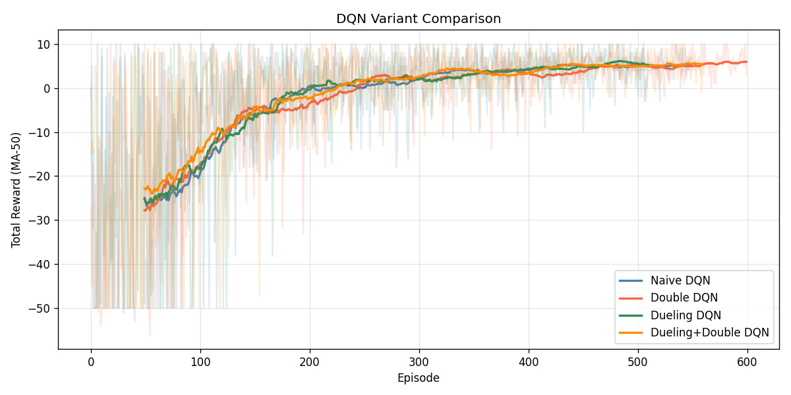

### Double DQN 訓練過程


### Dueling DQN 訓練過程


### Dueling + Double DQN 訓練過程


### 各階段快照 — Double DQN

| Ep 1 | Ep 300 | Ep 600（最終） |
|------|--------|--------------|
| 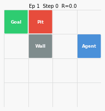 | 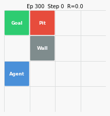 | 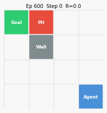 |

### 各階段快照 — Dueling DQN

| Ep 1 | Ep 300 | Ep 510（最終） |
|------|--------|--------------|
|  | 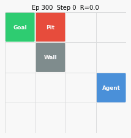 | 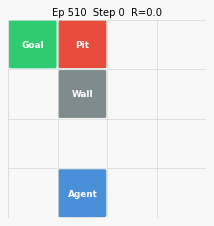 |

### 各階段快照 — Dueling + Double DQN

| Ep 1 | Ep 300 | Ep 560（最終） |
|------|--------|--------------|
| 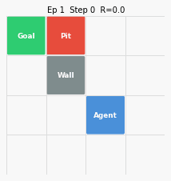 | 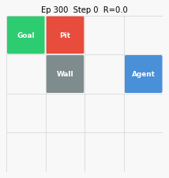 |  |

---

## HW3-3 — PyTorch Lightning DQN · Random Mode

### 為什麼原版會一直負 reward？

Random mode 有兩個根本困難，原版沒有解決：

**問題 1：State representation 無法泛化**  
原版用 64-dim flat one-hot 描述狀態。對 random mode，網路看到的是：
```
[0,0,0,1, 0,0,0,0, ...]  ← player 在 (0,3)，goal 在 (1,2)
[0,0,0,0, 1,0,0,0, ...]  ← player 在 (0,3)，goal 在 (0,0)
```
這兩個 state vector 完全不同，即使「goal 都在我左邊」這件事在結構上是相同的。  
MLP 沒辦法從 40K+ 個不同的 one-hot 組合中學到「往 Goal 靠近」這條通用規則。

**問題 2：每個 episode 只做 1 次 gradient update**  
原版 `RLDataset` 只 sample 1 個 batch，等於每個 episode 只更新網路一次。對 random mode 這樣的複雜任務更新量嚴重不足。

### 修了什麼

| 修正 | 說明 |
|------|------|
| **Enhanced State（72-dim）** | 64-dim one-hot + 8-dim 相對位置特徵（見下方） |
| **Potential-based Reward Shaping** | `r_shaped = r + 0.4 × (old_dist_goal - new_dist_goal)` |
| **每 episode 做 4 次 gradient update** | `RLDataset` 每次 yield 4 個 batch |

**8-dim 相對特徵的設計（加在 one-hot 後面）：**
```
player_row/3, player_col/3,          ← 自身絕對位置（邊界感知）
(goal_row  - player_row)/3,          ← Goal 在哪個方向、多遠
(goal_col  - player_col)/3,
(pit_row   - player_row)/3,          ← Pit 在哪個方向、多遠
(pit_col   - player_col)/3,
(wall_row  - player_row)/3,          ← Wall 在哪個方向、多遠
(wall_col  - player_col)/3
```
有了這 8 個特徵，網路直接看到「Goal 在右上方 2 格」，不需要自己從 one-hot 中學出相對關係。

**Reward Shaping 的原理：**  
這是 potential-based shaping（Ng et al., 1999）的近似版：  
`F(s, s') ≈ Φ(s) - Φ(s')` 其中 `Φ(s) = -manhattan_dist(player, goal)`。  
移近 Goal 一格 → shaped reward +0.4；遠離 Goal 一格 → −0.4。  
這**不改變最優策略**（因為是 potential-based），但大幅縮短 credit assignment 距離。

---

### 其他訓練技巧

| 技巧 | 設定 | 效果 |
|------|------|------|
| **梯度裁剪（Gradient Clipping）** | `max_norm = 10` | 防止梯度爆炸，穩定訓練初期 |
| **Cosine Annealing LR** | `η: 5e-4 → 1e-5` | 後期微調，避免在最優解附近震盪 |
| **Polyak Soft Update** | `τ = 0.005` | 每步都小幅更新 target net，比 hard update 更平滑 |
| **Huber Loss（SmoothL1）** | — | 對異常大的 TD error 不敏感，比 MSE 更穩健 |
| **Warm-up Replay** | 1000 步隨機填充 | 訓練前先填飽 buffer，確保初期 batch 多樣 |

#### 為何用 PyTorch Lightning

Lightning 把訓練迴圈的樣板程式碼（`optimizer.zero_grad()`、`loss.backward()`、梯度裁剪、LR scheduler）全部封裝成 hook，讓研究者專注在模型邏輯，同時方便整合 Logger、Checkpoint、Early Stopping。

### 怎麼觀察

- **Reward 曲線**：修正後 MA-50 應從負數穩定爬升到正值（目標 > 3）
- **Shaped vs. Unshaped**：曲線顯示的是**原始 reward**（不含 shaping），能直接看出真實學習進度
- **GIF 快照**：ep 1 時 Agent 亂走；引入相對特徵後，更早出現「往 Goal 方向走」的行為

### 訓練過程（random mode，每 50 ep 紀錄）


### Reward & Loss 曲線

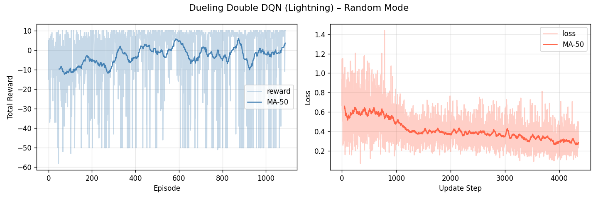

### 各階段快照

| Ep 1（完全隨機） | Ep 200（開始適應） | Ep 400（策略初現） | Ep 700（泛化策略） |
|---|---|---|---|
| 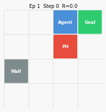 | 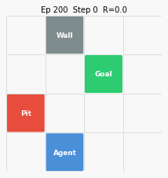 | 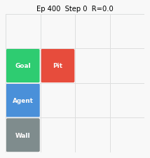 | 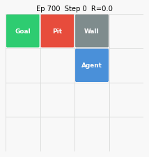 |

---

## HW3-4（加分題）— Rainbow DQN · Random Mode

### 做了什麼

Rainbow 將六項 DQN 改進**同時整合**，是目前 value-based RL 的 SOTA 基準之一。

### 原版的兩個 Bug（已修正）

**Bug 1（主因）：訓練採樣時呼叫了 eval mode 函式**

原版訓練迴圈在收集資料時，呼叫的是 `greedy_action()`，而它每步都執行 `online.eval()`：

```python
# ❌ 舊版：訓練迴圈裡用了 greedy_action() 採樣
for _ in range(MAX_STEPS):
    action = greedy_action(state)  # 每步都把 online 切到 eval mode！
```

`NoisyLinear` 在 `training=False` 時使用確定性平均權重（雜訊為零），等於從第一個 episode 起就完全關掉探索。

**Bug 2（次因）：`_net.train()` 是死碼**

即使是供 GIF 錄製使用的函式，`_net.train()` 也寫在 `return` 之後，永遠不會執行：

```python
# ❌ 舊版：return 後面的程式碼不會執行
def _greedy(s, _net=online):
    _net.eval()
    with torch.no_grad():
        return int(_net.q_values(t).argmax(1).item())
    _net.train()   # 死碼，永遠不執行
```

**修正：分離兩個函式，各司其職**

```python
# ✅ 訓練採樣：保持 train mode，讓 NoisyLinear 持續提供探索雜訊
def collect_action(s):
    with torch.no_grad():
        t = torch.tensor(s, dtype=torch.float32, device=device).unsqueeze(0)
        return int(online.q_values(t).argmax(1).item())

# ✅ GIF 錄製：暫用 eval（確定性策略），try/finally 保證一定切回 train
def greedy_action(s):
    online.eval()
    try:
        with torch.no_grad():
            t = torch.tensor(s, dtype=torch.float32, device=device).unsqueeze(0)
            return int(online.q_values(t).argmax(1).item())
    finally:
        online.train()
```

**影響**：兩個 bug 疊加，導致 NoisyNets 探索從第一個 episode 起就完全失效，replay buffer 缺乏多樣性，Q 值無法正確收斂。

### 其他改進（同 HW3-3）

- **Enhanced State（72-dim）**：加入相對位置特徵，解決 one-hot 無法泛化的問題
- **Reward Shaping**：potential-based shaping 加速信用分配

| 元件 | 解決的問題 | 實作方式 |
|------|-----------|---------|
| **Double DQN** | Q 值高估偏差 | online net 選動作，target net 評估 |
| **Dueling Networks** | 狀態估計低效 | 分離 V(s) 與 A(s,a) 兩條流 |
| **Noisy Nets** | ε-greedy 探索不夠精細 | 網路參數加入可學習的高斯雜訊，取代固定 ε |
| **C51（Distributional）** | 只預測期望值，忽略回報分布 | 預測 51 個原子的回報機率分布，用 Bellman 做分布更新 |
| **Prioritised Replay（PER）** | 均勻取樣浪費高 TD-error 樣本 | 依 TD error 大小決定取樣機率，搭配 IS 權重修正偏差 |
| **Multi-step Returns（n=3）** | 單步 TD 回傳信號慢 | 使用 3 步累積獎勵當目標，加快信用分配 |

#### C51 的核心概念

一般 DQN 學的是 `Q(s,a) = E[G]`，C51 改為學習整個回報分布 `Z(s,a)`：

```
Z(s,a) ~ 機率分布，支撐在 [V_min, V_max] 的 51 個等距原子上
```

Bellman 更新變成「把目標分布投影回原子格上」，以 cross-entropy loss 訓練。  
這讓 Agent 能感知回報的**風險與不確定性**，不只追求期望值最大。

### 怎麼觀察

- **Noisy Nets 探索的收縮**：GIF 初期路徑隨機多樣，後期收斂到固定策略，這正是 `σ_weight` 隨訓練減小的效果
- **PER 的效果**：loss 曲線早期下降應比均勻 replay 更快，因為優先取樣高錯誤率的樣本
- **Distributional 的效果**：reward 曲線的方差通常比 Naive DQN 更小，代表策略更穩健
- **Bug 修正的驗證**：有修正的版本 ep 100+ 後 reward 應持續上升；原版則在 ep 50 後停滯

### 訓練過程（random mode，5000 ep，每 50 ep 紀錄）


### Reward & Loss 曲線

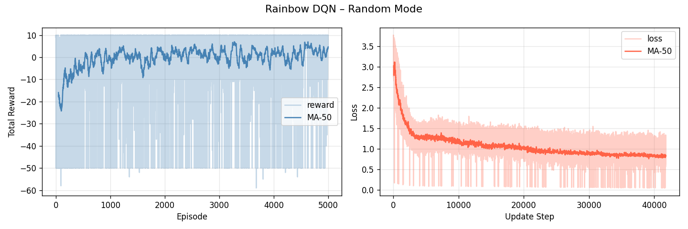

### 各階段快照

| Ep 1（探索期） | Ep 500（初步學習） | Ep 1500（策略收斂） | Ep 5000（最終策略） |
|---|---|---|---|
| 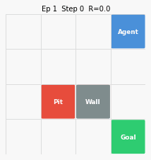 | 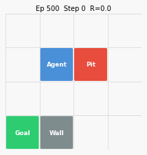 | 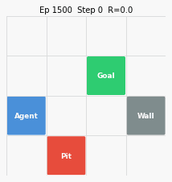 | 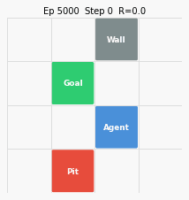 |

---

## 檔案結構

```
HW3/
├── pyproject.toml               # uv 專案設定，所有相依套件
├── gridworld.py                 # 4×4 GridWorld（static / player / random）
├── models.py                    # NaiveDQN、DuelingDQN、NoisyLinear、RainbowDQN
├── replay_buffer.py             # ReplayBuffer（均勻）+ PrioritisedReplayBuffer（PER）
├── utils.py                     # 繪圖、GIF 渲染工具函式
├── hw3_1_naive_dqn.py           # HW3-1：Naive DQN
├── hw3_2_enhanced_dqn.py        # HW3-2：Double / Dueling / D+D 比較
├── hw3_3_lightning_dqn.py       # HW3-3：PyTorch Lightning + 訓練技巧
├── hw3_4_rainbow_dqn.py         # HW3-4：Rainbow DQN（加分題）
├── make_training_gif.py         # 將各 epoch 快照組合成訓練進度 GIF
└── outputs/
    ├── hw3_1/                   # metrics.png、ep*.gif、training_progress.gif
    ├── hw3_2/                   # comparison.png、各變體子資料夾
    ├── hw3_3/                   # metrics.png、ep*.gif、training_progress.gif
    └── hw3_4/                   # metrics.png、ep*.gif、training_progress.gif
```

---

## 早停機制（Early Stopping）

所有訓練腳本均設有兩段式早停，滿足任一條件即停止：

| 條件 | 說明（HW3-1/2/3） |
|------|-----------------|
| **達標停止** | MA-50 reward 連續 **5** 次檢查（每 10 ep 一次）超過目標值 |
| **無改善停止** | MA-50 reward 在連續 **50** 次檢查內未進步超過 **0.2** |

各模式的目標值設定：

| 腳本 | 模式 | 目標 MA-50 | 上限 Episode |
|------|------|-----------|-------------|
| HW3-1 | static | 7.0 | 2000 |
| HW3-2 各變體 | player | 5.0 | 3000 |
| HW3-3 | random | 3.0 | 2000 |
| HW3-4 | random | 3.0 | 5000 |

> **為何目標值不同？** static 模式佈局固定，Agent 最快收斂；random 模式每回合佈局都變，最難達到高 reward，因此目標值較低。

> **HW3-4 的早停設定較寬鬆**（random mode + 分布式 RL 收斂慢）：達標條件需連續 **15** 次檢查（150 ep），無改善條件為 **150** 次檢查（1500 ep）內進步未超過 **0.05**。

---

## 訓練進度 GIF 說明

每個 `ep{N}.gif` 快照記錄了第 N 回合的**完整** greedy 執行軌跡（每一步都有）。  
`training_progress.gif` 會依序播放：

```
[title card: Episode 50] → 第50回合每一步 → [title card: Episode 100] → 第100回合每一步 → …
```

左上角顯示當前 episode 編號和步數，右上角有進度條顯示該回合已走了幾步。

---

## 執行所有實驗

```bash
# HW3-1：Naive DQN，static mode
uv run --frozen python hw3_1_naive_dqn.py

# HW3-2：DQN 變體比較，player mode
uv run --frozen python hw3_2_enhanced_dqn.py

# HW3-3：PyTorch Lightning，random mode
uv run --frozen python hw3_3_lightning_dqn.py

# HW3-4：Rainbow DQN，random mode（加分題）
uv run --frozen python hw3_4_rainbow_dqn.py

# 訓練完成後，組合訓練進度 GIF（播放每個 epoch 的完整回合）
uv run --frozen python make_training_gif.py --dir outputs/hw3_1 --out outputs/hw3_1/training_progress.gif
uv run --frozen python make_training_gif.py --dir outputs/hw3_2/double_dqn        --out outputs/hw3_2/double_progress.gif
uv run --frozen python make_training_gif.py --dir outputs/hw3_2/dueling_dqn       --out outputs/hw3_2/dueling_progress.gif
uv run --frozen python make_training_gif.py --dir outputs/hw3_2/dueling_double_dqn --out outputs/hw3_2/dd_progress.gif
uv run --frozen python make_training_gif.py --dir outputs/hw3_3 --out outputs/hw3_3/training_progress.gif
uv run --frozen python make_training_gif.py --dir outputs/hw3_4 --out outputs/hw3_4/training_progress.gif
```
